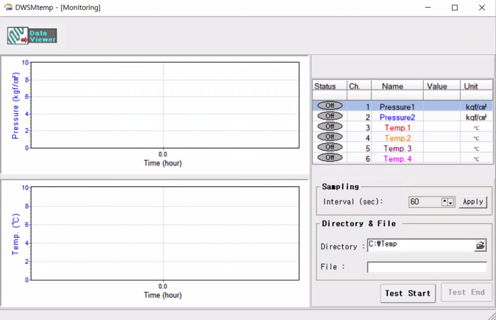
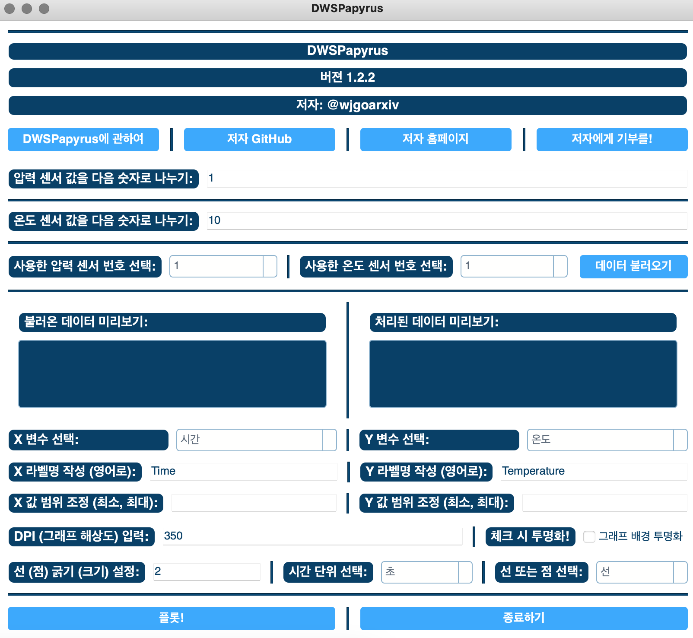
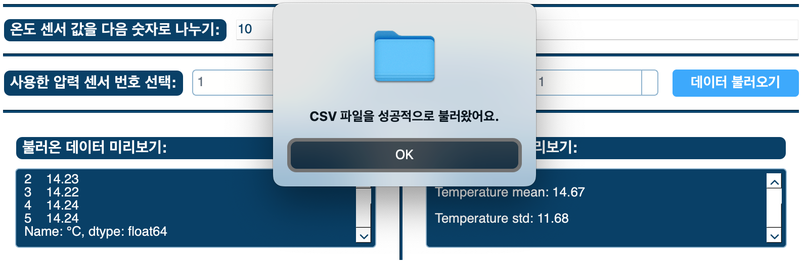
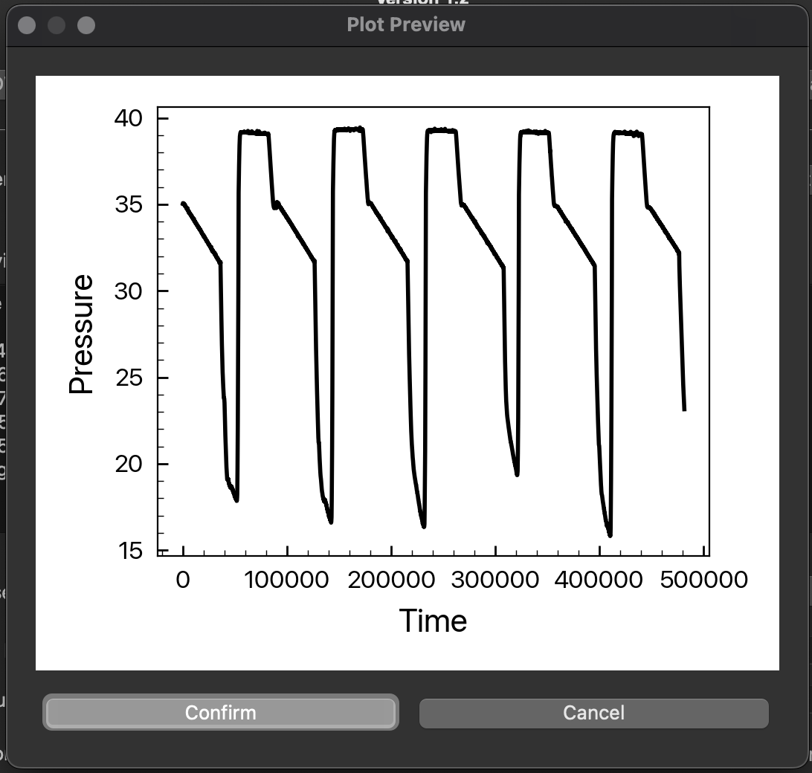
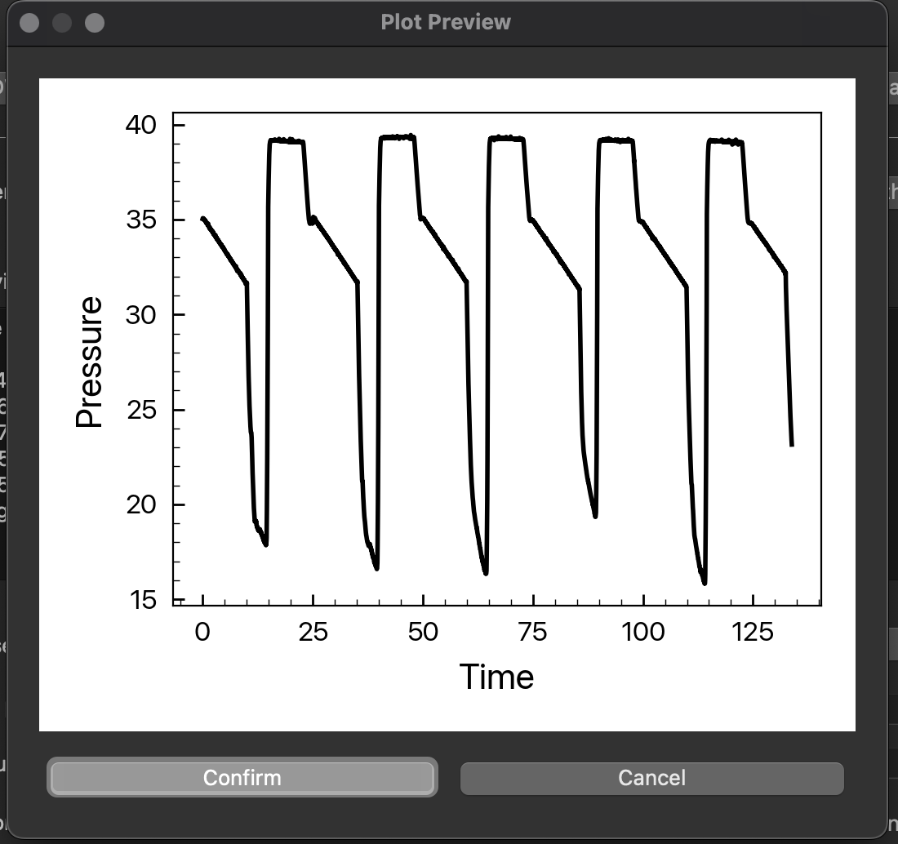
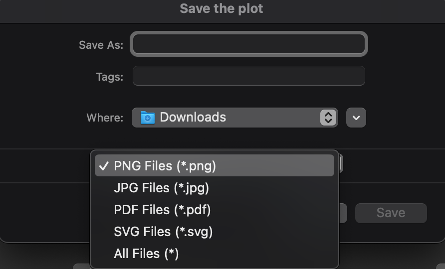

# DWSPapyrus
::자동 DWStemp (동원 프로그램) 그래프 제작 프로그램::

## 🗞️ NEWS
@2023-09-20: **V1.2**이 업데이트되었어요! [이 곳](https://github.com/wjgoarxiv/DWSPapyrus/releases/tag/DWSPapyrus)을 확인해보세요!

## 📄 개요
혹시... 이 프로그램이 익숙하신가요? 

 
그렇다면 이미 여러분은 다양한 실험을 `DWStemp` 프로그램과 같이 진행했을 가능성이 큽니다. 

- 이 리포지토리는 여러분과 같이 `DWStemp` 를 사용하는 <u>인턴, 대학원생, 혹은 연구자 분들</u>께서 <u>**실험 데이터를 더욱 빠르게 확인, 플롯팅**</u>할 수 있게 해드리기 위해 제작되었어요. 
- 실험이 완료된 `.csv` 파일을 넣어주세요, 원하는 그래프 형태 및 설정을 하신 뒤에 버튼을 누르면 그래프를 미리볼 수 있어요. 
- 그려진 그래프가 마음에 드시나요? `.png`, `.jpg`, `.pdf`, 혹은 `.svg` 의 형태로 해당 그래프를 저장하는 게 가능해요. 

## ⚙️ 설치 방법
1. [링크](https://github.com/wjgoarxiv/DWSPapyrus/releases/tag/DWSPapyrus)를 누르고 들어가 `.dmg` (MacOS를 사용하시는 경우) 혹은 `.exe` (Windows를 사용하시는 경우)를 다운 받아 설치해주세요. 
2. 처음 실행 시 실행에 다소 많은 시간이 걸릴 수 있어요. 
3. 윈도우의 경우, 프로그램 실행 시 바이러스로 오인될 수 있는데, 필자는 해당 프로그램을 통해 그 어떤 정보도 전송받지 않음을 말씀드립니다 (소스 코드를 확인해주세요). 

## ☝🏻 사용법 (튜토리얼)
> 직접 실험 데이터를 이용해 그래프를 그리는 과정을 따라해볼까요? 

1. 예시 파일을 `./Assets/` 폴더에 넣어놓았어요. `./Assets/Example1.csv`을 다운 받아 컴퓨터에 저장해주세요. 
2. 설치된 `DWSPapyrus.exe` (Windows) 혹은 `DWSPapyrus.app` (MacOS) 프로그램을 실행해주세요. 
3. 아래와 같은 창이 뜹니다. 
     
    먼저 실험에 사용한 압력 및 온도 포트번호를 기입해주세요. `./Assets/Example1.csv`의 경우, 압력, 온도 포트 모두 1번이었습니다. 
4. `Load the raw CSV` 버튼을 눌러 CSV 파일을 넣어주세요. 이 튜토리얼에서는 다운받은 `./Assets/Example1.csv` 파일을 넣으면 됩니다. 
5. `CSV file loaded successfully`라는 메시지가 뜨고, `Data preview` 및 `Treated data` 섹션에 다음과 같이 불러온 압력과 온도 정보가 도출됩니다. 
    
6. 그리고 싶은 그래프를 생각해보세요. X, Y 변수 조합에 따라 다양한 그래프를 그려볼 수 있어요. 먼저, X = Time / Y = Pressure로 두고 맨 아래 왼쪽의 `Plot data` 버튼을 눌러보세요. 아래와 같은 미리보기 창이 나타납니다. 
    
7. 시간 단위가 `Seconds`로 그려져, X축의 숫자가 너무 큽니다. 미리보기 창의 `Cancel` 버튼을 누르고 이번에는 `Time unit selection`의 `Seconds`를 `Hours`로 바꾼 뒤, 다시 `Plot data` 버튼을 눌러볼까요?  
    
8. 이제 이 그래프를 저장해보겠습니다. 미리보기 창의 `Confirm` 버튼을 눌러주세요. 아래 그림과 같이 다양한 옵션으로 그림 저장이 가능합니다.  
    
9. 여기서는 `output.png`라는 이름으로 그림을 저장해보겠습니다. 결과는 `./Assets/` 폴더의 `./Assets/output.png` 파일을 확인해보세요. [이 곳](Assets/output.png)을 눌러보세요!
10. 이제 다양한 옵션들을 만져보며 여러분만의 그래프를 그려보세요. 각 옵션들에 대한 설명은 다음과 같아요.
    - `Write the X (or Y) label`: 그래프에 표현 될 X 및 Y축의 라벨을 직접 입력할 수 있어요.
    - `X (or Y) scale adjustment`: 그래프의 X, Y축의 최솟값, 최댓값을 직접 정할 수 있어요. 예를 들어, 20부터 40까지의 값을 보고 싶다면 `20, 40`과 같은 형태로 해당 란에 값을 기입해주세요. 
    - `DPI selection`: 저장할 그래프의 DPI값오르 조절하는 곳이에요. 해당 값이 커질 수록 화질이 높아지고 출력 파일의 용량이 늘어난답니다.
    - `Transparent background`: 이 항목을 체크하면, 그래프의 배경이 투명하게 변합답니다. 
    - `Line width selection`: 이 값을 조절하면, 그래프의 선 굵기, 혹은 점 크기가 바뀌어요. 
    - `Line or scatter`: 선 그래프 (Line)를 그릴지, 점 그래프 (Scatter)를 그릴지 정할 수 있어요. 

----------
🎙️ 더 많은 정보를 얻고 싶으시거나 피드백을 남기시고 싶으시면, [제 깃허브 링크](https://github.com/wjgoarxiv/)에 방문해주세요! 감사합니다. 
