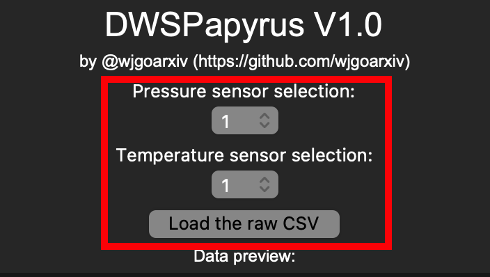
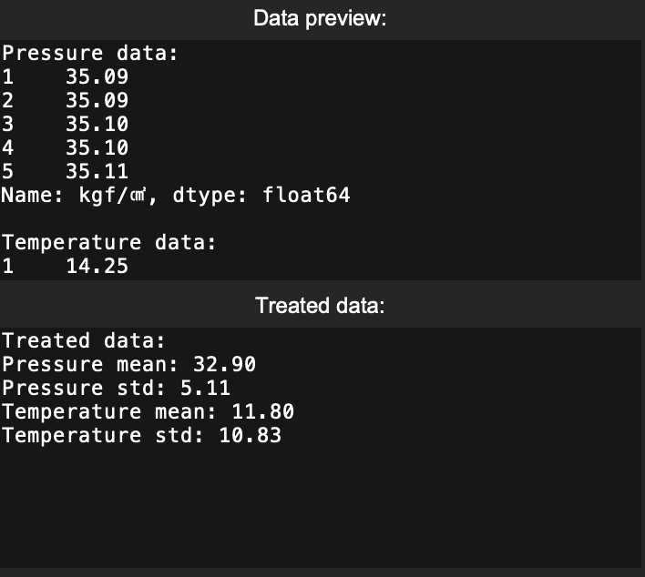
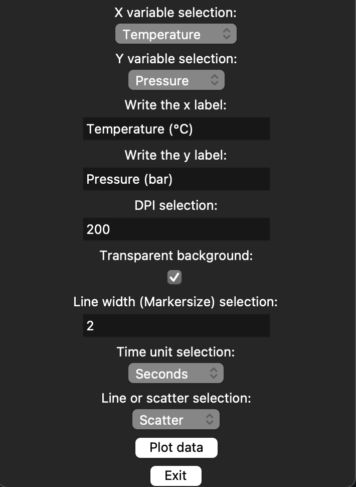

# DWSPapyrus
::자동 DWStemp (동원 프로그램) 데이터 그래프 변환기::

## 개요
☝🏻 이 리포지토리는 DWStemp (동원 SM 사 소프트웨어) 를 사용하는 인턴, 대학원생, 혹은 연구자 분들께서 실험 데이터를 더욱 빠르게 확인할 수 있게 해드리기 위해 제작되었어요.
🔍 Raw CSV 파일을 넣고, 원하는 그래프 형태 및 설정을 하신 뒤에 버튼을 누르면 그래프를 미리볼 수 있을 뿐만 아니라 고화질의 PNG 파일 또한 확인해보실 수 있어요. 

## 사용법
사용법은 무지무지 간단해요. 

1. 먼저, 본인이 사용한 압력 인디케이터 번호 (1 혹은 2), 그리고 온도 인디케이터 번호 (1 ~ 4)를 입력해주세요.
2. `Load the raw CSV` 버튼을 누르고, 데이터가 정상적으로 들어왔는지 확인해주세요.
 
3. 어떤 그래프를 그려볼 지 생각해보세요. 프리셋으로는 x축에 온도, y축에 압력을 그릴 수 있게 셋팅했어요.
4. Label (라벨) 입력이 제대로 되었는지 확인하세요. 본인이 선택한 변수와 해당 변수의 라벨이 일치해야 그래프가 정상적으로 출력돼요.
5. DPI 값을 높이면 더 높은 화질의 PNG를 출력할 수 있어요.
6. `Transparent background`를 클릭하면 그래프 배경을 투명하게 만들 수 있어요.
7. `Line width (Markersize) selection:` 값을 높이면 그래프의 선 굵기 (혹은 점 크기)가 커져요.
8. `Time unit selection`을 통해 시간 단위를 설정하세요 (x축에 시간을 넣는 경우에만).
9. `Plot data` 버튼을 통해 그래프를 확인하세요. 디렉토리도 확인해보세요. `PLOT.png`이라는 이름의 그래프 파일이 출력된답니다.

